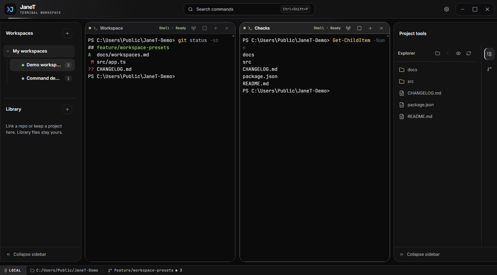
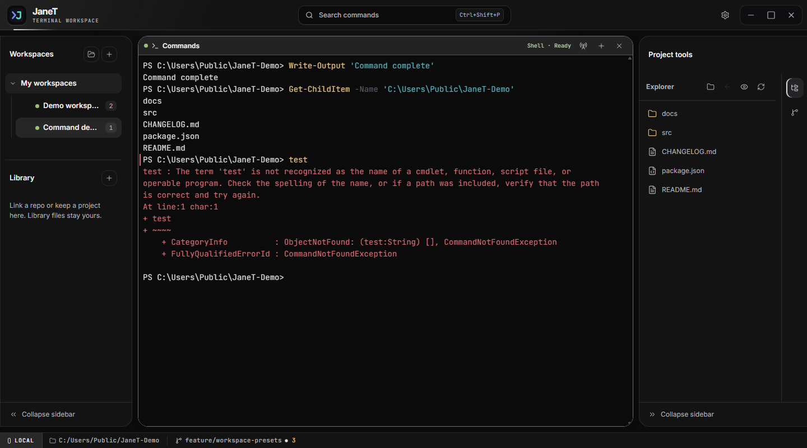
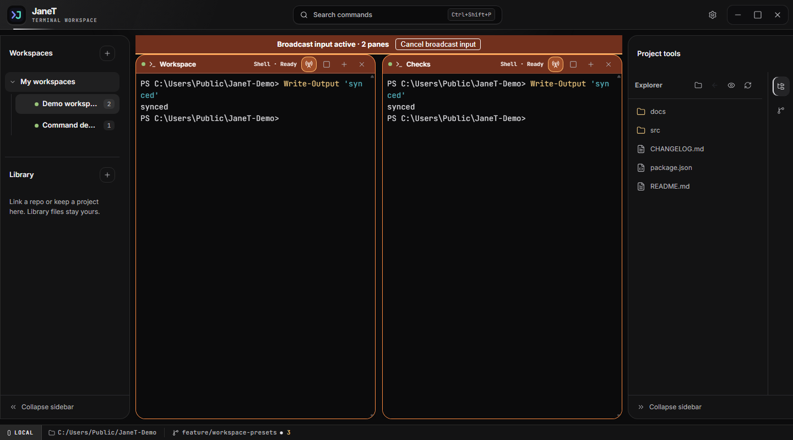
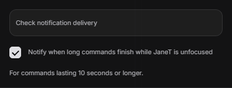
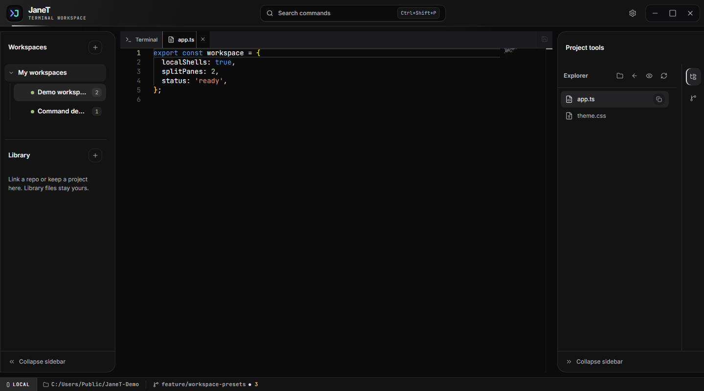
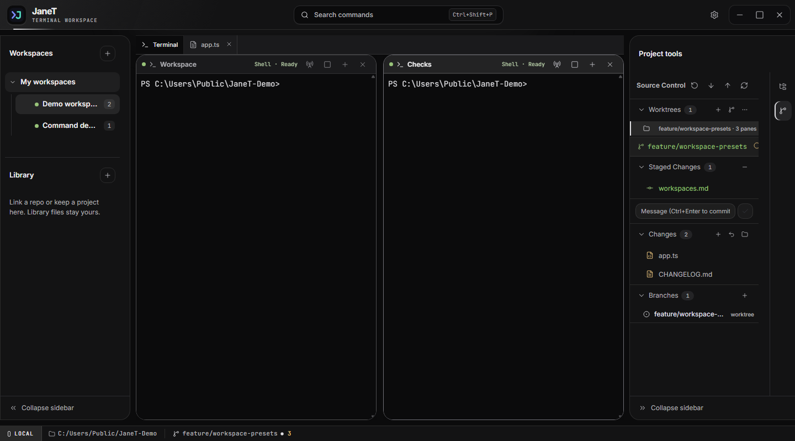
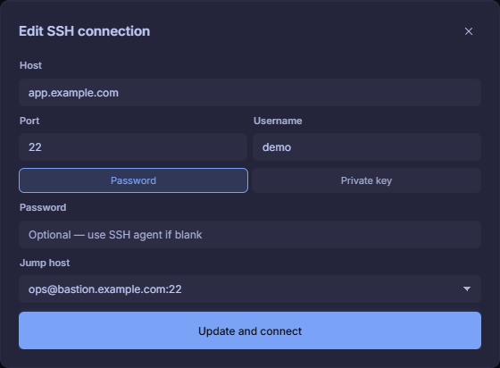
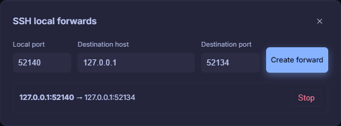

<p align="center">
  
</p>

<h1 align="center">JaneT</h1>

<p align="center">
  <strong>A focused desktop workspace for terminals, SSH, files, and Git.</strong><br>
  Keep the tools around your shell close without turning your terminal into a full IDE.
</p>

<p align="center">
  <a href="https://github.com/Sjormz/JaneT/releases/latest"></a>
  <a href="https://github.com/Sjormz/JaneT/actions/workflows/ci.yml"></a>
  
</p>

<p align="center">
  <a href="https://github.com/Sjormz/JaneT/releases/latest"><strong>Download JaneT</strong></a>
  ·
  <a href="https://github.com/Sjormz/JaneT/issues/new/choose">Report a bug or request a feature</a>
</p>



JaneT is for work that starts in a shell and quickly spreads across more shells, a remote server, a file tree, and Git. It keeps that working set in one window while your terminals remain real PTY-backed sessions.

## What JaneT brings together

- **Local and SSH terminals:** Run local shells or connect to remote machines with password or private-key authentication.
- **Tabs and split panes:** Build resizable layouts, maximize a pane when it needs your full attention, and mix local and SSH terminals in the same workspace.
- **Reusable presets:** Save a live pane layout, working directories, SSH profiles, and ordered startup commands. Open the whole setup again in one step.
- **Files and editing:** Browse the focused terminal's local directory or a remote machine over SFTP, then open supported text files in the built-in Monaco editor.
- **Everyday Git tools:** Stage, unstage, commit, fetch, pull, push, switch branches, manage worktrees, and safely discard tracked unstaged changes.
- **Durable sessions:** Keep active terminal and SSH work running when the window closes, or stop it before quitting.
- **Semantic command tools:** Jump between completed commands, copy a command or its output, and paste a command back without running it automatically.
- **Safe broadcast input:** Explicitly select panes, confirm the recipient set, then send the same keyboard, paste, or binary input to every selected terminal.
- **Contextual command history:** Search bounded local history by command text or SSH host without storing terminal output.
- **Focus-away notifications:** Optionally receive a native notification when a long command finishes while JaneT is unfocused.
- **Secure SSH routing:** Reach a saved host through one saved jump host and manage session-owned local forwards from the SSH tab.
- **AI agent awareness:** See when a supported terminal agent is running, ready, waiting for input, or finished without reading its transcript.
- **Fast navigation:** Search terminal output, launch actions from the command palette, save command snippets, and rebind every shortcut.
- **A workspace that feels like yours:** Choose from Tokyo Night, Dracula, One Dark, Solarized Light, and Gruvbox, then tune terminal typography and sidebar placement.

## Navigate completed commands



JaneT understands the command lifecycle reported by supported shells. After a command finishes, you can move between completed commands without searching the whole terminal buffer:

| Action | Default shortcut |
| --- | --- |
| Select the previous completed command | `Ctrl+Shift+ArrowUp` |
| Select the next completed command | `Ctrl+Shift+ArrowDown` |
| Copy the selected command | `Ctrl+Alt+C` |
| Copy the selected command's output | `Ctrl+Alt+O` |
| Paste the selected command for editing | `Ctrl+Alt+R` |

Paste for rerun is deliberately safe: it inserts the command through JaneT's normal paste path but never adds Enter. Review or edit it, then press Enter yourself when it is ready.

JaneT automatically adds semantic markers to new local Bash, zsh, fish, Windows PowerShell, and PowerShell 7 sessions while preserving existing prompt hooks. Unsupported local shells continue to work as ordinary terminals. JaneT does not modify a remote shell's startup files; SSH command tracking is available only when that remote shell already emits compatible OSC 133 markers.

## Find a command in contextual history

Completed semantic commands are also available from **Search commands** (`Ctrl+K`) → **Open command history**.

1. Search by command text or SSH label.
2. Select an entry to paste it into the currently focused terminal.
3. Press Enter yourself if you want to run it.

History is intentionally local and bounded to the newest 256 entries. JaneT stores command text, timing, outcome, and directory or host context; it never stores terminal output or imports your shell-history files.

## Broadcast input only to panes you choose



Broadcast input is useful for running the same interactive step in several local or SSH panes, but it stays off until you deliberately arm it:

1. Split the current tab until every destination pane is visible.
2. Use the checkbox in each pane header to select every recipient, including the pane you will type in.
3. Select at least two panes and confirm the warning.
4. Type or paste in any selected pane. JaneT sends that user input exactly once to every selected recipient.
5. Press `Escape` or choose **Cancel broadcast input** in the banner to stop immediately.

Selected panes remain visibly highlighted while broadcast is active. JaneT cancels the recipient set when its tab, pane, terminal, or SSH session becomes stale, and terminal protocol responses are never rebroadcast.

## Get notified after a long command



Focus-away notifications are disabled by default. To enable them:

1. Open the gear menu in the title bar.
2. Enable **Notify when long commands finish while JaneT is unfocused**.
3. Set the minimum command duration in seconds. The default is 10 seconds.
4. Move to another window while a tracked command runs.

JaneT checks the current focus state again immediately before showing a native notification. The notification contains only bounded outcome, duration, tab, pane, and local-or-SSH context metadata—never the command text or terminal output. Notification availability and presentation still depend on the operating system's notification support and settings.

## Know when your agent needs you

JaneT can show live agent status in pane headers and tabs, including **Running**, **Needs input**, **Ready**, and completed turn outcomes. Status comes from explicit lifecycle events rather than transcript scraping, so no agent protocol text is added to the visible terminal.

Hermes Agent's classic terminal interface is supported through the included JaneT awareness plugin:

```bash
hermes plugins install Sjormz/JaneT/integrations/hermes-agent-awareness --enable
```

Restart any running Hermes sessions after installation. No JaneT configuration is required.

Other terminal agents continue to work normally in JaneT, but do not show agent-aware status until they provide a compatible lifecycle integration. Hermes TUI awareness is ready in the plugin and will be advertised once its required Hermes runtime fix is available in a public release.

## Build the workspace once

Split a tab into the layout your project needs, combine local and remote panes, then save it as a preset. Each pane can remember its own directory or SSH connection and run an ordered list of startup commands when a fresh workspace opens.

Presets work well for repeatable setups such as an app shell beside a test runner, several services in one grid, or a local project paired with its deployment host.

## Move between terminal and file without losing context



The Explorer follows the focused local shell as its working directory changes. In an SSH pane, the same view browses the remote filesystem through SFTP. Open a text file in JaneT's built-in Monaco editor, save it locally or remotely, then return to the terminal tab without leaving the workspace.

Files and folders can also be dragged from the Explorer into a compatible terminal to paste a correctly escaped path.

## Handle everyday Git work in place



JaneT detects the repository under the focused local terminal and keeps its status visible. The Source Control panel can:

- stage and unstage individual files or all changes
- commit staged changes
- fetch, fast-forward pull, and push
- create, switch, and safely delete branches
- create, open, remove, and prune Git worktrees
- discard tracked unstaged changes after explicit confirmation
- surface conflicts, ahead/behind counts, and staged or unstaged state

Destructive history operations are deliberately left to the terminal. JaneT does not hide resets, rebases, or force pushes behind a button.

## SSH as part of the workspace

Save an SSH connection once and reopen it from the tab rail or a preset. JaneT pins host keys, reconnects restored SSH panes, and gives the focused remote terminal an SFTP-backed Explorer and editor.

A preset can combine local and SSH panes, so a project shell, log stream, and remote deployment session can share one saved layout.

### Reach a host through a jump host



JaneT supports one optional saved jump host per SSH profile:

1. Open **SSH** in the tab rail and save the bastion or jump host as a normal connection first.
2. Create or edit the destination connection.
3. Choose the saved bastion under **Jump host**.
4. Select **Save and connect** or **Update and connect**.

The jump and destination authenticate separately and each host key is verified independently. JaneT supports one hop only; nested or cyclic jump routes are rejected.

### Open a local tunnel through a live SSH session



1. Connect an SSH tab and wait until its shell is ready.
2. Right-click that tab and choose **Manage local forwards**.
3. Enter a local port, destination host, and destination port. Use local port `0` to let the operating system choose a free port.
4. Choose **Create forward** and use the displayed `127.0.0.1` port from a local application.
5. Choose **Stop** when the tunnel is no longer needed.

Local forwards bind only to loopback, belong to the live SSH session, and close automatically when that session disconnects. JaneT does not provide public bind addresses, remote forwarding, or a SOCKS proxy.

## Download

Installers and portable builds are published on the [latest release](https://github.com/Sjormz/JaneT/releases/latest):

| Platform | Packages |
| --- | --- |
| Windows x64 | Installer and portable `.exe` |
| macOS Apple silicon and Intel | `.dmg` and `.zip` |
| Linux x64 | AppImage and Debian package |

JaneT checks GitHub Releases for updates from inside the app.

> [!NOTE]
> JaneT is under active alpha development. Current macOS releases are ad-hoc signed and not notarized, so Gatekeeper may require you to open JaneT explicitly from Finder. See the [release documentation](docs/release.md#macos-release-signing) for details.

## Default shortcuts

| Action | Shortcut |
| --- | --- |
| Command palette | `Ctrl+K` |
| New terminal tab | `Ctrl+N` |
| Search terminal output | `Ctrl+F` |
| Toggle workspace tools | `Ctrl+B` |
| Open snippets | `Ctrl+Shift+P` |
| Split pane right | `Ctrl+\` |
| Split pane below | `Ctrl+Shift+\` |
| Previous completed command | `Ctrl+Shift+ArrowUp` |
| Next completed command | `Ctrl+Shift+ArrowDown` |
| Copy completed command | `Ctrl+Alt+C` |
| Copy completed command output | `Ctrl+Alt+O` |
| Paste completed command for rerun | `Ctrl+Alt+R` |

All shortcuts can be changed in Settings.

## Build from source

JaneT requires Node.js 22.12 or newer.

```bash
git clone https://github.com/Sjormz/JaneT.git
cd JaneT
npm install
npm run dev
```

Create and start a production build with:

```bash
npm run build
npm start
```

Create a platform package with `npm run dist`. Platform-specific scripts are also available in `package.json`.

## Tested as a desktop application

Pull requests run TypeScript checks, unit and component tests, a production build, and Electron end-to-end workflows. Release jobs package Windows, macOS, and Linux builds and exercise the packaged terminal runtime before publishing the release assets.

JaneT uses Electron, React, TypeScript, xterm.js, node-pty, Monaco, ssh2, SFTP, and simple-git.

## Contributing

Contributions are welcome. Read [CONTRIBUTING.md](CONTRIBUTING.md) for local setup, validation commands, and pull request expectations. Please use the repository's issue templates for bug reports and feature requests, and GitHub's private security advisory flow for security-sensitive reports.

## License

MIT
