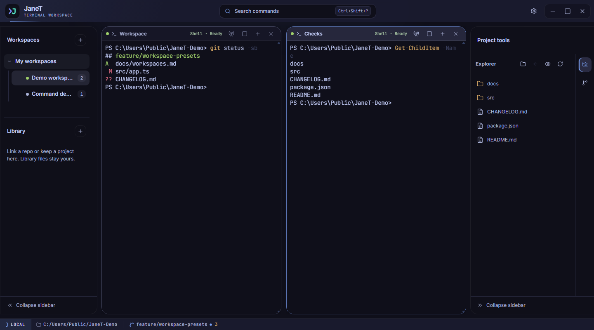

<p align="center">
  
</p>

<h1 align="center">JaneT</h1>

<p align="center">
  A focused desktop workspace for local terminals, files, and Git.
</p>

<p align="center">
  <a href="https://github.com/Sjormz/JaneT/releases/latest"></a>
  <a href="https://github.com/Sjormz/JaneT/actions/workflows/ci.yml"></a>
</p>

<p align="center">
  <a href="https://sjormz.github.io/JaneT/"><strong>JaneT Documentation</strong></a>
  ·
  <a href="https://github.com/Sjormz/JaneT/releases/latest"><strong>Download JaneT</strong></a>
</p>

JaneT keeps real local shell sessions, split terminal panes, project files, and everyday Git work together in one desktop app. Organize work into workspaces and Library sessions, browse and edit files beside your terminals, and restore your workspace layout when you reopen the app.



## Features

- Local PTY-backed terminals with tabs, resizable split panes, and configurable shortcuts
- Workspaces for temporary projects and Library sessions for existing folders
- File browsing and a built-in editor for supported text files
- Git status, staging, commits, branches, and worktree management
- Command search, snippets, semantic command navigation, and optional focus-away notifications
- Optional status indicators for supported terminal agents

See the [documentation site](https://sjormz.github.io/JaneT/) for setup, workflows, settings, screenshots, and troubleshooting.

## Download

Download the latest version from [GitHub Releases](https://github.com/Sjormz/JaneT/releases/latest). Current packages are:

| Platform | Packages |
| --- | --- |
| Windows x64 | Installer and portable executable |
| macOS Apple silicon | DMG and ZIP |
| Linux x64 | AppImage and Debian package |

## Run from source

JaneT requires Node.js 22.12 or newer.

```bash
git clone https://github.com/Sjormz/JaneT.git
cd JaneT
npm ci
npm run dev
```

Contributor setup and validation instructions are in [CONTRIBUTING.md](CONTRIBUTING.md). Report bugs and request features through the [GitHub issue templates](https://github.com/Sjormz/JaneT/issues/new/choose). Report security issues through GitHub's private security advisory flow.

## License

MIT
